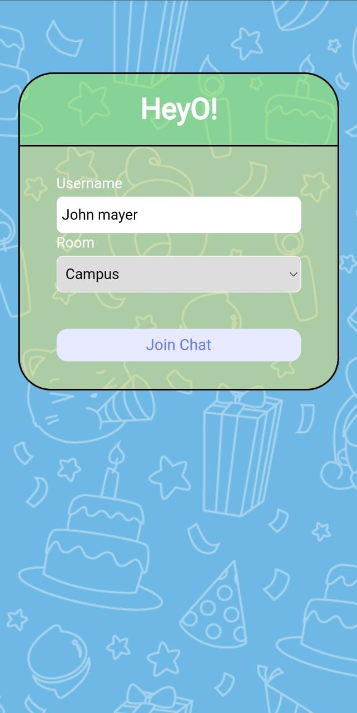
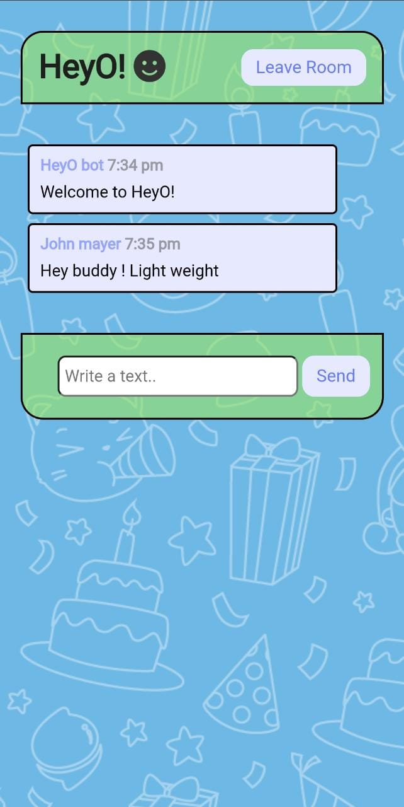

# HeyO! ChatApp

Hey! It's time to chat with your friends using HeyO!. 
HeyO! is a multiroom realtime chat application created using nodejs and socket.io
that sends and shows messages to a recipient instantly without any page refresh. Enter your username and select a room , you'll enter into a realtime chat window.
User can join and leave a room anytime , just with a single click. It shows the list of members in a room and the room name .  
 
## Tech
 
HeyO! uses a number of technologies:

- [Node.js] - evented I/O for the backend
- [Express] - fast node.js network app framework  
- [Socket.io] - enables real-time, bi-directional communication between web clients and servers
- [HTML] - Building block of a webpage
- [CSS] - designing the UI
- [Vanilla Js] - JS framework used for building incredible, powerful JavaScript applications
 
## Installation

The code for the chat app can be found at the public GitHub repo [RealTimeChatApp](https://github.com/manan03/RealTimeChatApp). Either clone the repo to a local folder on your machine or download and extract the archive if you don't have Git installed.
```bash
npm install 
````
Install socket.io and express 
```
npm i socket.io 
npm i express
```
To start the server 
```bash
node server.js
```
Your server will now be running on http://localhost:3000/

## How To Use
I have deployed this webApp using heroku and here's the link [HeyO!.com](https://heyo-26.herokuapp.com/) 
This will direct you to the home page of the website.


- Enter your username and select a room. It will direct you to a room with all the members already present .


- HeyO chat bot will welcome you with a message. 
- Multiple users can join and leave at any time in a room.


 - It will broadcast every user when a new member joins the room or leaves the room. 

## Phone UI
  

<table>
  <tr>
    <td>Home Page</td>
     <td>Join and leave</td>
     <td>Chat page</td>
  </tr>
  <tr>
    <td></td>
    <td></td>
    <td></td>
  </tr>
 </table>

## Contributing
Pull requests are welcome. For major changes, please open an issue first to discuss what you would like to change.

  
